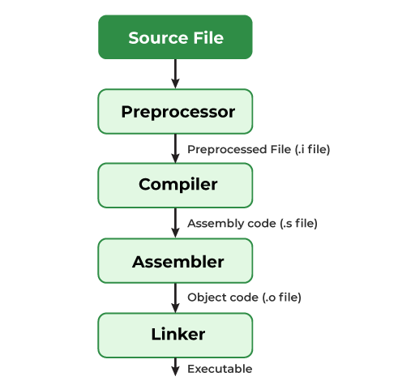

# Compiling C Code
*Compilation* is the process of converting human-readable `C` code into an executable that can be run on the computer.

## The Compilation Process 
There are four steps to C compilation:

1. Pre-Processing
2. Compilation
3. Assembly
4. Linking

### Pre-processing 
In this phase, included files and macros are expanded, i.e. inserted into the code in places where they are referenced in the source code. The following are completed during pre-processing:

1. Removal of Comments
2. Expansion of Macros
3. Expansion of included files
4. [Condional compilation](https://www.cs.auckland.ac.nz/references/unix/digital/AQTLTBTE/DOCU_078.HTM)

Pre-processed output is stored in a file with a `.i` extension. 

### Compiling
During the compilation step, the `.i` file is transformed into assembly code stored in a `.s` file. 

### Assembling
During assembling, the assembly code is turned into machine-level instructions stored in a `.o` file. The output of this stage is a binary representation of the program.

### Linking
In the linking phase, all function calls are linked with their definitions. Additionally, extra code is added for correctly running the program. The linking phase glues together all the individual pieces of a program into a single, coherent whole. 

There are two types of linking: 

1. **Static Linking:** All code is copied to a single file and an executable is created from it.
2. **Dynamic Linking:** Only the names of shared libraries are added to the code and then referenced during execution. 

By default, GCC performs *dynamic linking*. 

## Sources
1. 
